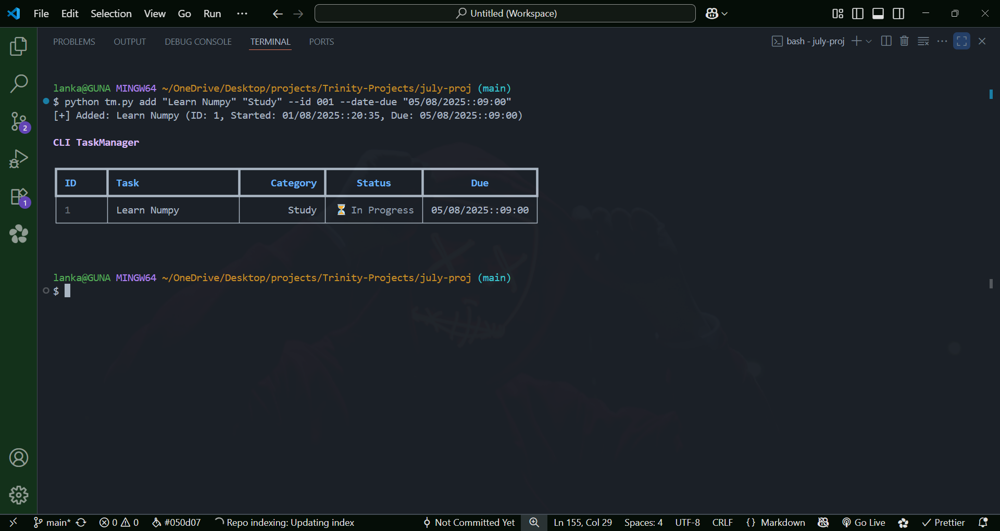
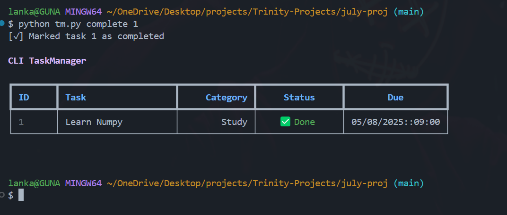
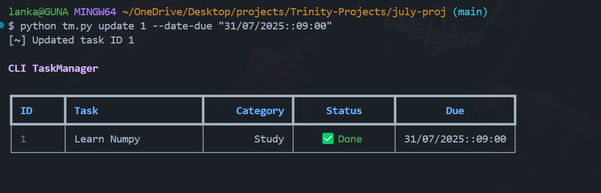

# 🧰 CLI ListManager

A clean and minimal command-line To-Do/Task Manager built with Python, Typer, and Rich — developed as part of my **July 2025 Trinity Developer Foundations** learning phase.

This project was my hands-on way to understand how real software is structured, built, and maintained. I kept it simple, modular, and focused — no unnecessary features, just what a CLI task manager needs.

---

## 📋 Table of Contents

- [Features](#-features-v10)
- [Prerequisites](#-prerequisites)
- [Quick Start](#-quick-start)
- [Features & Usage](#️-features--usage)
- [Project Structure](#-project-structure)
- [Data Format](#-data-format)
- [Error Handling](#-error-handling)
- [Concepts Covered](#-concepts-covered-in-july-2025)
- [Learning Journey](#-july-2025-trinity-project-summary)
- [Design Goals](#-design-goals)
- [Screenshots](#-screenshots)
- [Contributing](#-contributing)
- [Known Limitations](#-known-limitations)
- [Future Enhancements](#-future-enhancements)
- [License](#-license)
- [Author](#-author)

---

## 📦 Features (v1.0)

✅ Lightweight JSON-based persistence  
✅ Clear command structure using Typer  
✅ Beautiful CLI tables with Rich  
✅ Modular code split across logic, CLI, and styling  
✅ Git-based solo team-style workflow (3 dev roles)

---

## 🔧 Prerequisites

Before running this project, make sure you have:

- **Python 3.8+** (tested on Python 3.8, 3.9, 3.10, 3.11)
- **Git** (for cloning the repository)

---

## 🚀 Quick Start

```bash
# Clone the repository
git clone https://github.com/guna2007/July-Project.git
cd July-Project

# Add your first task
python tm.py add "Learn Python CLI development" "Learning"

# View all tasks
python tm.py show

# Mark task as completed
python tm.py complete 1

# Get help for any command
python tm.py --help
```

---

## 🛠️ Features & Usage

Below are the implemented features with example CLI commands:

### 1. 📋 View Tasks

Displays all tasks in a Rich-formatted table.

```bash
python tm.py show
```

### 2. ➕ Add Task

```bash
python tm.py add "Complete Python CLI project" "Work"
python tm.py add "Submit assignment" "School" --date-due "30/07/2025::18:00" --id 101
```

### 3. ✅ Mark as Completed

```bash
python tm.py complete 2
```

### 4. 🗑️ Delete Task

```bash
python tm.py delete 3
```

### 5. ✏️ Update Task

```bash
python tm.py update 2 --task "Update README" --category "Docs" --date-due "30/07/2025::20:00"
```

### 6. 🧹 Clear All Tasks

```bash
python tm.py clear
```

---

## 📁 Project Structure

```bash
July-Project/
│
├── tm.py         # Main CLI using Typer
├── tasks.py      # Task class and logic
├── data.py       # Load/Save tasks from JSON
├── data.json     # Local persistent store
├── README.md     # Documentation
└── screenshots/  # Screenshots of CLI in action
```

---

## 📄 Data Format

Tasks are stored in `data.json` with the following structure:

```json
{
  "tasks": [
    {
      "id": 1,
      "task": "Complete Python CLI project",
      "category": "Work",
      "date_added": "25/07/2025::14:30",
      "date_due": "30/07/2025::18:00",
      "completed": false
    }
  ]
}
```

---

## ⚠️ Error Handling

The application handles common errors gracefully:

- **Invalid Task ID**: Shows error message if task ID doesn't exist
- **File Permissions**: Creates `data.json` if it doesn't exist
- **Malformed JSON**: Backs up corrupted file and creates new one
- **Invalid Date Format**: Provides clear format requirements
- **Empty Task Lists**: Shows friendly message when no tasks exist

---

## 🧠 Concepts Covered in July 2025

This mini project was the culmination of my July 2025 Developer Foundations learning phase. It integrates the following concepts:

### ✅ Python

- Data types, functions, modules
- File I/O with JSON
- OOP (Task class, methods, object creation)
- Exception handling

### ✅ CLI Tools

- Typer for command parsing
- Typer decorators: @app.command(), positional and optional arguments

### ✅ Rich Library

- Rich tables for visual output
- Color highlights, status symbols

### ✅ Git & GitHub

- git init, commit, branch, push
- Simulated solo-team workflow with 3 dev roles
- Structured project development using Git

---

## 📅 July 2025: Trinity Project Summary

| Week | Focus                          | Topics Learned                          | Progress           |
| ---- | ------------------------------ | --------------------------------------- | ------------------ |
| 1    | Python Core + Loops            | Data types, conditionals, functions     | ✅ Completed       |
| 2    | Git, Markdown, CLI Basics      | Git CLI, GitHub, Markdown README        | ✅ Completed       |
| 3    | Typer, Rich, OOP in Python     | Typer, Rich, OOP design, exceptions     | ✅ Completed       |
| 4    | CLI Mini Project – ListManager | Architecture, styling, UX, modular code | ✅ MVP Done (v1.0) |

---

## 💡 Design Goals

- Clean UX with helpful table formatting
- Easily extensible structure
- Local file-based task persistence
- Learn by doing — not just following tutorials

---

## 🧱 Built With

- Python
- Typer
- Rich
- Git
- VS Code + GitHub

---

## 📸 Screenshots

Here are the CLI in action:

### Add Task



### Mark Task as Completed



### Update Task



### Clear All Tasks


---

## 🤝 Contributing

This is a learning project, but contributions are welcome! Here's how you can help:

### Getting Started

1. Fork the repository
2. Create a feature branch (`git checkout -b feature/amazing-feature`)
3. Make your changes
4. Run tests (if any)
5. Commit your changes (`git commit -m 'Add amazing feature'`)
6. Push to the branch (`git push origin feature/amazing-feature`)
7. Open a Pull Request

### Code Style

- Follow PEP 8 Python style guidelines
- Use meaningful variable and function names
- Add comments for complex logic
- Keep functions small and focused

---

## ⚠️ Known Limitations

- **Single User**: Designed for single-user local usage
- **No Data Validation**: Limited input validation on task content
- **Date Format**: Fixed date format (DD/MM/YYYY::HH:MM)
- **No Task Priority**: No priority levels for tasks
- **No Categories Filter**: Can't filter tasks by category
- **No Search**: No search functionality within tasks

---

## 🚀 Future Enhancements

### v1.1 Planned Features

- [ ] Task priority levels (High, Medium, Low)
- [ ] Filter tasks by category or status
- [ ] Search tasks by keyword
- [ ] Export tasks to CSV/PDF
- [ ] Task due date reminders

### v2.0 Ideas

- [ ] Multiple user profiles
- [ ] Task categories with colors
- [ ] Recurring tasks
- [ ] Task dependencies
- [ ] Cloud sync capabilities

---

## 📄 License

This project is licensed under the MIT License - see the [LICENSE](LICENSE) file for details.

```
MIT License

Copyright (c) 2025 [Your Name]

Permission is hereby granted, free of charge, to any person obtaining a copy
of this software and associated documentation files (the "Software"), to deal
in the Software without restriction, including without limitation the rights
to use, copy, modify, merge, publish, distribute, sublicense, and/or sell
copies of the Software, and to permit persons to whom the Software is
furnished to do so, subject to the following conditions:

The above copyright notice and this permission notice shall be included in all
copies or substantial portions of the Software.

THE SOFTWARE IS PROVIDED "AS IS", WITHOUT WARRANTY OF ANY KIND, EXPRESS OR
IMPLIED, INCLUDING BUT NOT LIMITED TO THE WARRANTIES OF MERCHANTABILITY,
FITNESS FOR A PARTICULAR PURPOSE AND NONINFRINGEMENT. IN NO EVENT SHALL THE
AUTHORS OR COPYRIGHT HOLDERS BE LIABLE FOR ANY CLAIM, DAMAGES OR OTHER
LIABILITY, WHETHER IN AN ACTION OF CONTRACT, TORT OR OTHERWISE, ARISING FROM,
OUT OF OR IN CONNECTION WITH THE SOFTWARE OR THE USE OR OTHER DEALINGS IN THE
SOFTWARE.
```

---

## 👨‍💻 Author

**[L.Guna]** - _Trinity Developer Foundations July 2025_

- GitHub: [@guna2007](https://github.com/guna2007)
- Project Link: [https://github.com/guna2007/July-Project](https://github.com/guna2007/July-Project)

---

## 🙏 Acknowledgments

- **Trinity Developer Foundations** - For the structured learning path
- **Typer Documentation** - For excellent CLI framework guidance
- **Rich Library** - For beautiful terminal formatting
- **Python Community** - For amazing tools and resources

---

## 🙌 Final Thoughts

This project taught me how to build something real from scratch — not just code, but structure, collaboration, and clarity. I kept it minimal on purpose, and every feature was added with intent. No fluff, just function.
